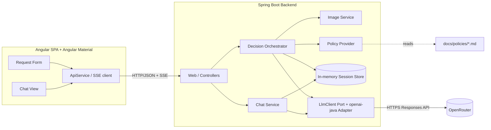
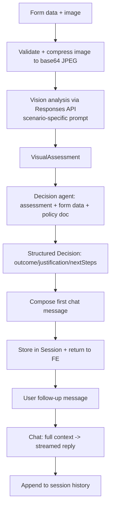
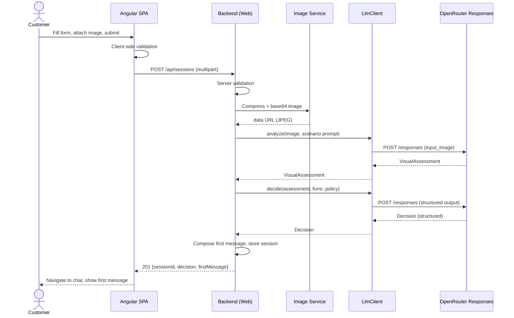
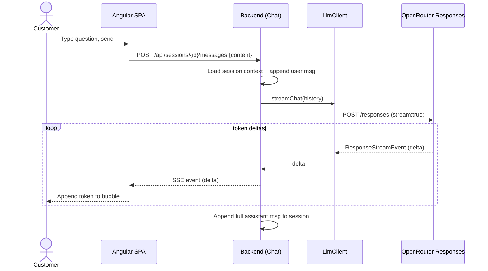
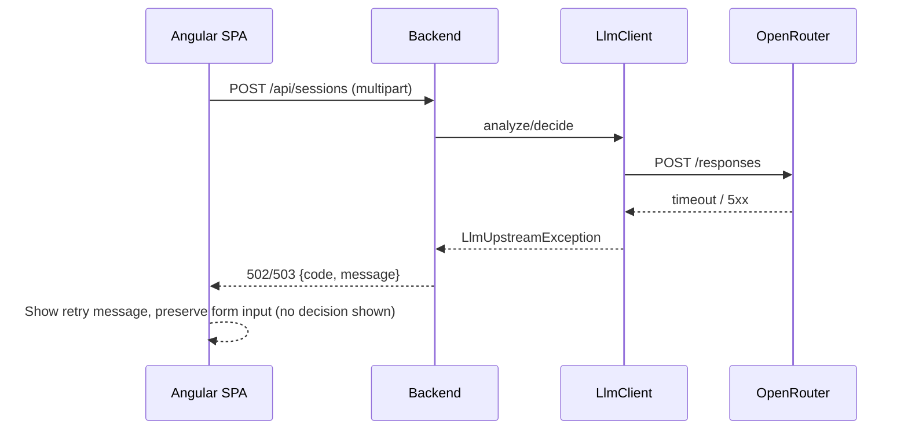

# ADR: Hardware Service Decision Copilot — Main Architecture

**Date:** 2026-06-24
**Status:** Accepted
**PRD:** [`docs/PRD-Product-Requirements-Document.md`](../PRD-Product-Requirements-Document.md)

---

## 1. Overview

The Hardware Service Decision Copilot is an MVP web application that gives an end customer an
immediate, policy-grounded assessment of an electronics **complaint** (fault claim) or **return**
(no-fault refund) request. The customer fills a form and uploads one photo; the backend compresses
the image, sends it to a multimodal model for a visual assessment, then a reasoning agent combines
that assessment with the form data and the applicable company policy document to produce a decision
(**Approve / Reject / Escalate**) with justification. The result becomes the first message of a chat
interface where the customer can ask follow-up questions with streamed responses.

This ADR defines the overall system: components, technology stack, cross-cutting decisions, data
models, environment, and testing strategy. Three area ADRs detail each layer:

- [`001-backend-api.md`](001-backend-api.md) — Spring Boot HTTP/SSE API, session state, image handling
- [`002-llm-integration.md`](002-llm-integration.md) — openai-java + OpenRouter Responses API, prompts, decisioning
- [`003-frontend.md`](003-frontend.md) — Angular + Angular Material form and chat UI

---

## 2. Context7 Library References

Implementing agents must fetch docs using these handles — do not search again.

| Library | Context7 Handle | Used for |
|---|---|---|
| Spring Boot | `/spring-projects/spring-boot` | Backend application, REST controllers, SSE, configuration |
| OpenAI Java SDK | `/openai/openai-java` | LLM client (Responses API) against OpenRouter — vision, streaming, structured output |
| Angular | `/angular/angular` | Frontend SPA framework |
| Angular Material | `/websites/material_angular_dev` | UI component primitives for form and chat |

> Authoritative external docs: OpenRouter Responses API — https://openrouter.ai/docs/api/reference/responses/overview
> and "Create a response" — https://openrouter.ai/docs/api/api-reference/responses/create-responses

---

## 3. System Architecture

### Architecture pattern
Monorepo with a clear two-tier split: an **Angular single-page application** (presentation) talking
over HTTP/JSON and SSE to a **Spring Boot REST backend** (application + AI orchestration). The
backend is the only component that holds the OpenRouter API key and talks to the LLM. There is no
database in the MVP — session state is in-memory.

### Repository structure
```
app/
  backend/            Spring Boot (Maven) application
    src/main/java/...     controllers, services, LLM client, image, session
    src/main/resources/   application.yml
    src/test/java/...      unit + integration tests
    pom.xml
    mvnw, mvnw.cmd, .mvn/  Maven Wrapper (Maven is not installed globally)
  frontend/           Angular application
    src/app/...           form + chat features, services, models
    src/proxy.conf.json   dev proxy -> backend
docs/
  policies/           return-policy.md, complaint-policy.md (injected into prompts)
```

The frontend and backend are independent build artifacts. In dev they run as two processes; the
Angular dev server proxies `/api/*` to the backend (see Decision 8.6).

### Technology stack

| Layer | Technology | Reason |
|---|---|---|
| Backend | Spring Boot 3.5.x (Java 21) | Mandated stack; mature REST + SSE support; aligns with NBP Java edition |
| Build | Maven via Maven Wrapper | Mandated; wrapper required because `mvn` is not installed locally |
| LLM client | openai-java (`com.openai:openai-java`, 4.41.x) | Official SDK; supports Responses API, vision, streaming, structured output, custom base URL |
| LLM gateway | OpenRouter Responses API (beta) | Stakeholder choice; OpenAI-compatible; vision + streaming confirmed on `/api/v1/responses` |
| Image processing | `javax.imageio` (JDK built-in) | No extra dependency; sufficient to downscale + re-encode JPEG |
| Frontend | Angular (latest) + Angular Material | Mandated stack; Material primitives compose the form and a custom chat UI |
| Session state | In-memory store (server process) | MVP has no persistence requirement; DB is Backlog |

### Out of scope (from PRD, restated)
No authentication, no database/persistence, no customer-history lookup, no RAG, no specialist/admin
UI, multiple images, notifications, payments, localization, or native mobile apps.

---

## 4. Module Structure & Dependencies

| Module | Responsibility | Depends on | Depended on by |
|---|---|---|---|
| `web` (controllers) | HTTP/SSE endpoints, request validation, multipart parsing, error mapping | `decision`, `chat`, `session` | — (entry point) |
| `decision` (orchestration) | Runs vision analysis → decision agent; builds first message | `llm`, `policy`, `image`, `session` | `web` |
| `chat` | Streams follow-up replies using full session context | `llm`, `session` | `web` |
| `llm` (client port + adapter) | Wraps openai-java Responses API; vision, decision, streaming chat | openai-java | `decision`, `chat` |
| `image` | Validate, compress, base64-encode the uploaded image | `javax.imageio` | `decision` |
| `policy` | Load and provide the applicable policy document text | filesystem (`docs/policies`) | `decision` |
| `session` | In-memory session store: form data, assessment, message history | — | `decision`, `chat`, `web` |

**Dependency direction:** `web` → orchestration (`decision`, `chat`) → infrastructure (`llm`, `image`,
`policy`, `session`). No module depends back on `web`. No circular dependencies. The `llm` module is
exposed through an interface (port) so the Responses API adapter is the only place coupled to
openai-java (see [`002`](002-llm-integration.md)).

---

## 5. Data Models

All models are in-memory only; nothing is persisted in the MVP.

- **RequestType** — enum: `COMPLAINT`, `RETURN`. Drives prompt selection and policy selection.
- **EquipmentCategory** — enum: `SMARTPHONE`, `LAPTOP`, `TABLET`, `HEADPHONES`, `SMARTWATCH`, `OTHER`.
- **ServiceRequest** — the submitted form: `requestType`, `category`, `modelName` (text),
  `purchaseDate` (date, not future), `reason` (text; required when `COMPLAINT`), plus the uploaded
  image (transient, not stored after analysis).
- **VisualAssessment** — output of the multimodal step. For RETURN: `signsOfUse` (bool),
  `damageObserved` (bool), `resalableAsNew` (bool), `notes`, `confidence`. For COMPLAINT:
  `damaged` (bool), `damageType`, `damageLocation`, `probableCause`, `confidence`. Plus
  `analyzable` (bool) — false when the image is blurry/wrong-item/inconclusive.
- **Decision** — `outcome` (enum `APPROVE` | `REJECT` | `ESCALATE`), `binding` (bool; true only for
  `APPROVE`), `justification` (text referencing policy rule), `nextSteps` (list of strings),
  `ruleReferences` (list).
- **ChatMessage** — `role` (`SYSTEM` | `USER` | `ASSISTANT`), `content` (text/markdown), `createdAt`.
- **Session** — `sessionId` (opaque id), `request` (ServiceRequest minus raw image),
  `assessment` (VisualAssessment), `decision` (Decision), `messages` (ordered ChatMessage list),
  `createdAt`. Held in an in-memory store keyed by `sessionId`, with a TTL and a max-entry cap
  (see [`001`](001-backend-api.md)).

---

## 6. API / Interface Contracts (summary)

Full contracts in [`001-backend-api.md`](001-backend-api.md). Boundary summary:

| Endpoint | Input | Output | Notes |
|---|---|---|---|
| `POST /api/sessions` | multipart/form-data: form fields + one image | `201` `{ sessionId, decision, firstMessage }` | Runs compression + vision + decision; first message is non-streamed |
| `POST /api/sessions/{id}/messages` | JSON `{ content }` | `text/event-stream` token deltas | Streamed assistant reply; appends to history |
| `GET /api/sessions/{id}` | — | `200` session snapshot (messages, decision) | For reload/debug |
| `GET /api/health` | — | `200` | Liveness |

Error responses use a consistent JSON error body (`{ code, message, fields? }`) with status codes:
`400` validation, `404` unknown session, `415` unsupported media type, `413` payload too large,
`502`/`503` LLM upstream failure/timeout.

---

## 7. Environment Variables

Sourced from `.env.example`. The backend reads these (mapped into `application.yml` placeholders).

| Variable | Purpose | Required | Example value |
|---|---|---|---|
| `OPENROUTER_API_KEY` | OpenRouter API key (used if `OPENAI_API_KEY` unset) | Yes | `sk-or-v1-...` |
| `OPENAI_API_KEY` | Preferred API key if present (SDK default var) | No | `sk-...` |
| `OPENROUTER_BASE_URL` | LLM base URL (`baseUrl` on the SDK client) | Yes | `https://openrouter.ai/api/v1` |
| `OPENROUTER_TEXT_MODEL` | Model for decision agent + chat | Yes | `openai/gpt-5.4-mini` |
| `OPENROUTER_VISION_MODEL` | Model for multimodal image analysis | Yes | `openai/gpt-5.4-mini` |
| `OPENROUTER_MODEL` | Fallback model when a split var is missing (dev only) | No | `openai/gpt-5.4-mini` |
| `PORT` | Backend HTTP port (`server.port`) | No | `3000` |

API-key resolution: use `OPENAI_API_KEY` if set, otherwise `OPENROUTER_API_KEY` (matches
`.env.example` note). OpenRouter ranking headers (`HTTP-Referer`, `X-Title`) are optional and may be
attached via the SDK's additional-headers mechanism.

---

## 8. Technical Decisions

### 8.1 Use the OpenRouter Responses API (not Chat Completions)
**Status:** Accepted **Date:** 2026-06-24
**Context:** The backend needs multimodal image analysis, a reasoning/decision step, and streamed
chat. Two OpenRouter surfaces are available: GA Chat Completions and the beta Responses API.
**Decision:** Use the **Responses API** (`POST /api/v1/responses`) per stakeholder choice. Confirmed
via OpenRouter docs that the endpoint accepts `InputImage` (base64 data URL or remote URL, with
`detail` levels) and supports streaming; openai-java exposes it via `client.responses().create` and
`createStreaming` with `ResponseStreamEvent` / `ResponseAccumulator`.
**Rejected alternatives:**
- Chat Completions (GA): more stable and fully documented for vision/streaming, but not the chosen direction.
- Hybrid (Completions now, Responses later): rejected to avoid building two code paths; mitigated instead by the `LlmClient` port (8.2).
**Consequences:**
- (+) Forward-looking, single reasoning-capable API for vision, decision, and chat.
- (−) Beta status: possible breaking changes; the `llm` adapter is the blast radius if the contract shifts.
**Review trigger:** If OpenRouter changes the Responses schema, removes beta features, or vision/streaming proves unreliable — reassess against Chat Completions.

### 8.2 Isolate the LLM behind a port (interface)
**Status:** Accepted **Date:** 2026-06-24
**Context:** The Responses API is beta and the model/provider may change.
**Decision:** Define an `LlmClient` interface with three operations (analyze image, decide, stream chat); the only openai-java-coupled code lives in a single adapter implementation.
**Rejected alternatives:** Call the SDK directly from services — rejected; spreads beta-API coupling across the codebase.
**Consequences:** (+) Swappable provider, mockable in tests. (−) Minor extra abstraction.
**Review trigger:** If a second provider or API is added.

### 8.3 In-memory session state, no database
**Status:** Accepted **Date:** 2026-06-24
**Context:** PRD lists persistence as Backlog; MVP needs only per-session conversation context.
**Decision:** Store sessions in an in-memory, thread-safe store with TTL + max-entry eviction. Expose a `SessionStore` interface so a persistent implementation can be added later.
**Rejected alternatives:** SQLite/Postgres now — rejected as out of MVP scope.
**Consequences:** (+) Zero infra, fast. (−) State lost on restart; single-instance only (acceptable for MVP).
**Review trigger:** When the Backlog "session & decision persistence" feature is scheduled.

### 8.4 Streamed chat via SSE; first decision message non-streamed
**Status:** Accepted **Date:** 2026-06-24
**Context:** PRD AC-27 wants a responsive loading experience; the first decision requires a complete vision+decision computation.
**Decision:** Follow-up chat replies stream token deltas over `text/event-stream`. The first decision message is computed fully server-side and returned in the `POST /api/sessions` response (not streamed).
**Rejected alternatives:** Stream everything including the first message — rejected; the decision must be fully resolved (and structured) before display.
**Consequences:** (+) Snappy chat, deterministic first message. (−) Two response styles to implement/test.
**Review trigger:** If first-message latency becomes a UX problem.

### 8.5 Structured decision output, server-composed first message
**Status:** Accepted **Date:** 2026-06-24
**Context:** AC-15 requires exactly one of three outcomes; AC-19/20 require binding vs preliminary wording; AC-22 fixes the first-message structure.
**Decision:** The decision agent returns a **structured** object (outcome enum, justification, next steps, rule references) via the Responses API structured-output feature. The backend deterministically composes the first chat message (greeting → decision → justification → binding/preliminary status note → next steps) from that object.
**Rejected alternatives:** Free-text first message from the model — rejected; risks missing the mandatory status/disclaimer and a non-enumerated outcome.
**Consequences:** (+) Deterministic, testable, disclaimer guaranteed. (−) Message wording partly templated.
**Review trigger:** If product wants fully model-authored messaging.

### 8.6 Local two-process dev with Angular dev-server proxy
**Status:** Accepted **Date:** 2026-06-24
**Context:** MVP/course environment; no containers required.
**Decision:** Backend runs via `./mvnw spring-boot:run`; frontend via `ng serve` with a proxy mapping `/api/*` to the backend, avoiding CORS config in dev.
**Rejected alternatives:** Docker Compose / single-jar packaging — deferred; unnecessary for the MVP.
**Consequences:** (+) Simplest setup. (−) Two terminals; production packaging deferred.
**Review trigger:** When a deployable artifact is needed.

### 8.7 Target Java 21; attempt the installed JDK 25 first, fall back to JDK 21
**Status:** Accepted **Date:** 2026-06-24 **Amended:** 2026-06-25
**Context:** Stakeholder chose Java 21 + Spring Boot 3.5; the build machine currently has JDK 25, and Spring Boot 3.5 is not certified for Java 25. To avoid an unnecessary JDK install if the existing toolchain happens to work, the PoC orchestration plan (Decision 4) refined the build/run approach.
**Decision:** Configure the project to **compile and target Java 21** (`<java.version>21</java.version>`) — this is fixed, regardless of which JDK runs the build. For the local build/run toolchain, **attempt the installed JDK 25 first**; if Spring Boot 3.5 fails to build or run on it (toolchain/bytecode/certification issue), install a JDK 21 (e.g. Temurin 21) and pin the build to it. CI pins JDK 21. Record which path was taken during scaffolding (step B0).
**Rejected alternatives:** *Target* (compile to) Java 25 — rejected; outside Spring Boot 3.5 support matrix. Mandate a JDK 21 install up front before trying JDK 25 — relaxed to the try-25-first approach above to save an install when unneeded; JDK 21 remains the guaranteed fallback. Target Java 17 — not chosen by stakeholder.
**Consequences:** (+) Supported, LTS bytecode target; virtual threads available; avoids a JDK install when JDK 25 can build/run Spring Boot 3.5. (−) JDK 25 is uncertified for Spring Boot 3.5, so the first attempt may fail and require the JDK 21 fallback; CI must still pin 21 for a certified build.
**Review trigger:** When Spring Boot certifies Java 25, or NBP standardizes a different JDK.

> **Amendment (2026-06-25):** The original decision required installing JDK 21 up front and not relying on JDK 25. It was amended to match PoC plan Decision 4: keep the compile target at Java 21, but try the already-installed JDK 25 for the local build/run first and fall back to installing JDK 21 only if Spring Boot 3.5 fails on JDK 25. The compile/bytecode target (Java 21) is unchanged.

---

## 9. Diagrams

### 9.1 Architecture / Component Diagram


### 9.2 Data Flow Diagram


### 9.3 Sequence Diagrams

#### Form submission and AI decision (happy path)


#### Chat follow-up (streaming)


#### LLM failure (error path)


---

## 10. Testing Strategy

### Philosophy
TDD per repo rules: write/extend tests before production code, confirm they fail for the right
reason, implement the minimum to pass, then refactor green. The only external dependency mocked at
integration level is the OpenRouter LLM API.

### Test layers

| Layer | Type | Scope | Tools |
|---|---|---|---|
| Unit | Logic in isolation | Validation, image compression, prompt selection, decision mapping, message composition, SSE parsing (FE) | JUnit 5 + Mockito (BE); Jasmine/Karma (FE) |
| Integration | Backend with real wiring | Controllers + serialization + SSE; LLM API faked | JUnit 5 + Spring Boot Test + MockWebServer (only the OpenRouter endpoint is faked) |
| E2E | Full real stack | Form → decision → chat in a browser | Playwright |

### Key test scenarios
- **Happy path — return approved:** valid form + clean-item image → `APPROVE`, binding wording, first message has all required parts. Edge: item exactly at the 30-day boundary.
- **Happy path — complaint approved:** valid complaint + defect image within warranty → `APPROVE`. Edge: damage type ambiguous → `ESCALATE`.
- **Reject:** return image shows wear → `REJECT` with preliminary disclosure and cited rule.
- **Escalate:** blurry/wrong-item image → `ESCALATE`; never fabricates a decision.
- **Validation:** missing required field, complaint without reason, non-JPEG/PNG/WebP, image > 10 MB → blocked with field/error mapping (FE inline; BE 400/413/415).
- **LLM failure:** upstream timeout/5xx → 502/503; FE shows retry, preserves input, shows no decision.
- **Chat streaming:** follow-up question streams deltas; full message persisted; off-topic question is declined/redirected.
- **Context retention:** chat answers reflect form data + assessment + first decision.

### Technical acceptance criteria
- **TAC-01:** The LLM client is reachable only through the `LlmClient` interface; no controller/service imports openai-java types directly.
- **TAC-02:** Integration tests fake only the OpenRouter HTTP endpoint; no other component is mocked.
- **TAC-03:** Image compression produces a JPEG whose longest edge ≤ the configured maximum and whose encoded size is below the configured target before base64 encoding.
- **TAC-04:** The decision outcome is always exactly one of `APPROVE`, `REJECT`, `ESCALATE` (enum-validated), and `binding` is true only for `APPROVE`.
- **TAC-05:** `POST /api/sessions` returns `201` with `sessionId` and a first message containing greeting, decision, justification, status note, and next steps.
- **TAC-06:** `POST /api/sessions/{id}/messages` responds with `Content-Type: text/event-stream` and emits ≥1 delta event for a normal reply.
- **TAC-07:** Validation failures return the documented status codes (`400`/`413`/`415`) with a structured error body; no LLM call is made on validation failure.
- **TAC-08:** On LLM timeout/5xx the API returns `502`/`503` and never returns a decision payload.
- **TAC-09:** A Playwright E2E run completes the full form→decision→chat flow against the real stack.
- **TAC-10:** The backend builds and runs on Java 21; the app starts and `GET /api/health` returns `200` before any commit (per repo "start the app before committing" rule).
