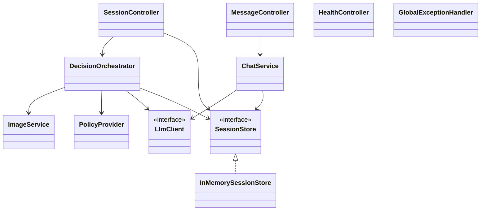
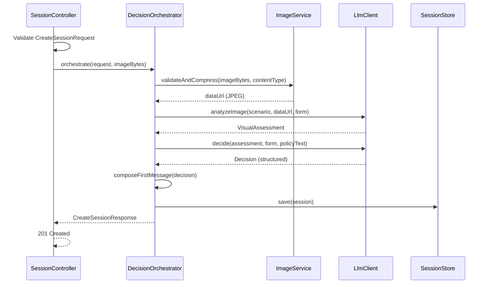
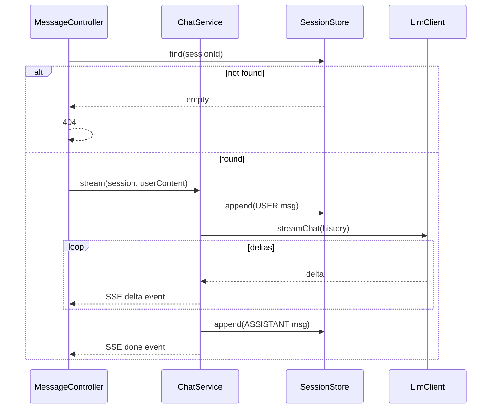

# ADR-001: Backend API (Spring Boot)

**Date:** 2026-06-24
**Status:** Accepted
**Relates to:** [`000-main-architecture.md`](000-main-architecture.md)

---

## 1. Scope

Covers the Spring Boot backend: HTTP/SSE endpoints, request validation, multipart/image intake,
in-memory session state, error handling, and configuration. Does **not** cover LLM prompt design or
the openai-java adapter internals (see [`002`](002-llm-integration.md)) or the frontend (see
[`003`](003-frontend.md)).

---

## 2. Context7 References

| Library | Context7 Handle | Used for |
|---|---|---|
| Spring Boot | `/spring-projects/spring-boot` | Web layer, validation, SSE (`SseEmitter`/reactive), config, testing |

---

## 3. Component Design

Layered within the backend:

- **Controllers (`web`)** — three concerns:
  - `SessionController.create` — handles `POST /api/sessions` (multipart): binds form fields and the
    image part, triggers orchestration, returns the session id + first message.
  - `MessageController.stream` — handles `POST /api/sessions/{id}/messages`: returns an SSE stream of
    assistant token deltas.
  - `SessionController.get` / `HealthController` — snapshot + liveness.
- **DecisionOrchestrator (`decision`)** — coordinates: validate → compress (Image) → analyze (Llm) →
  decide (Llm) → compose first message → persist to session. Pure application logic; no HTTP types.
- **ChatService (`chat`)** — loads session, appends the user message, asks the `LlmClient` to stream
  a reply, forwards deltas to the controller, and appends the completed assistant message.
- **ImageService (`image`)** — validation + compression (detailed below).
- **PolicyProvider (`policy`)** — loads `return-policy.md` or `complaint-policy.md` based on
  `RequestType` and returns its text for prompt injection. Files are read once and cached in memory.
- **SessionStore (`session`)** — interface with a default in-memory implementation backed by a
  concurrent map; entries carry a creation timestamp. Eviction: TTL (configurable, default 2 h) and
  a max-entry cap (configurable, default 500, oldest evicted first). A `PersistentSessionStore` can
  replace it later without touching callers.
- **GlobalExceptionHandler** — maps exceptions to the structured error body and status codes.

State management: conversation state lives only in `SessionStore`. Controllers are stateless.

### Image validation & compression (PRD AC-07/08/10/11)
- Accept only `image/jpeg`, `image/png`, `image/webp`. Reject others with `415`.
- Reject uploads > 10 MB (pre-compression) with `413`.
- Validate the declared content type against actual bytes (magic-number sniff) to avoid spoofed types.
- Compress with `javax.imageio`: decode → downscale so the longest edge ≤ a configured maximum
  (default 1568 px) preserving aspect ratio → re-encode as JPEG at a configured quality (default
  ~0.8) → base64 into a `data:image/jpeg;base64,...` URL for the Responses API `input_image`.
- If the source is smaller than the maximum edge, skip upscaling; still re-encode to JPEG to bound size.

---

## 4. Data Structures (DTOs)

- **CreateSessionRequest** (multipart): `requestType` (enum), `category` (enum), `modelName`
  (string, non-blank), `purchaseDate` (ISO date, not future), `reason` (string; required when
  `requestType=COMPLAINT`), `image` (file part, required).
- **DecisionDto**: `outcome` (`APPROVE`|`REJECT`|`ESCALATE`), `binding` (bool), `justification`
  (markdown), `nextSteps` (string[]), `ruleReferences` (string[]).
- **CreateSessionResponse**: `sessionId` (string), `decision` (DecisionDto), `firstMessage`
  (markdown string), `createdAt`.
- **PostMessageRequest**: `content` (string, non-blank, max length bounded).
- **SSE event payloads**: `delta` events `{ token }`; a terminal `done` event `{ finishReason }`; an
  `error` event `{ code, message }` if the stream fails mid-way.
- **SessionSnapshot**: `sessionId`, `requestType`, `category`, `decision`, `messages[]`.
- **ApiError**: `code` (machine string), `message` (human text), `fields` (map of field→message,
  for validation errors only).

---

## 5. Interface Contracts

### `POST /api/sessions`
- **Consumes:** `multipart/form-data`.
- **Input:** fields of `CreateSessionRequest` + `image` part.
- **Success:** `201 Created`, body `CreateSessionResponse`.
- **Errors:** `400` (missing/invalid field; complaint without reason; future purchase date),
  `415` (unsupported image type), `413` (image > 10 MB), `502`/`503` (LLM analysis/decision failed).
- **Notes:** No auth. No LLM call occurs until validation passes. Idempotency not required (each
  submit creates a new session).

### `POST /api/sessions/{sessionId}/messages`
- **Consumes:** `application/json` (`PostMessageRequest`). **Produces:** `text/event-stream`.
- **Output:** ordered `delta` events, then a `done` event. On upstream failure mid-stream, an
  `error` event is emitted and the stream closes.
- **Errors (before stream opens):** `404` (unknown/expired session), `400` (blank content).
- **Notes:** The assistant message is appended to the session only after the stream completes
  successfully. Off-topic inputs are answered with a brief in-domain redirect (enforced by the
  system prompt — see [`002`](002-llm-integration.md)).

### `GET /api/sessions/{sessionId}`
- **Output:** `200` `SessionSnapshot`; `404` if unknown/expired. For reload/debugging.

### `GET /api/health`
- **Output:** `200`. Liveness only.

---

## 6. Technical Decisions

### 6.1 SSE for streaming chat
**Status:** Accepted **Date:** 2026-06-24
**Context:** Chat replies must stream (Decision 8.4); the request carries a body, so a GET-only
`EventSource` is unsuitable on the client, but the server side is a standard SSE response.
**Decision:** Expose `text/event-stream` from a `POST` endpoint. The frontend reads the stream via
`fetch` + a streaming body reader (see [`003`](003-frontend.md)). Server uses Spring's SSE support.
**Rejected alternatives:** WebSocket — heavier, bidirectional not needed; long-poll — worse UX.
**Consequences:** (+) Simple, HTTP-native. (−) Client cannot use the native `EventSource` API.
**Review trigger:** If bidirectional or reconnect-heavy features appear.

### 6.2 Multipart intake for form + image
**Status:** Accepted **Date:** 2026-06-24
**Context:** One request carries text fields and a binary image.
**Decision:** Use `multipart/form-data` for `POST /api/sessions`; configure max upload size to 10 MB
so oversize uploads are rejected as `413` before processing.
**Rejected alternatives:** Base64 image inside JSON — larger payloads, awkward validation.
**Consequences:** (+) Standard, streamable. (−) Slightly more controller binding code.
**Review trigger:** If multiple images are ever allowed.

### 6.3 In-memory session store with eviction
**Status:** Accepted **Date:** 2026-06-24
**Context:** No persistence in MVP (Decision 8.3) but memory must be bounded.
**Decision:** Concurrent in-memory map behind a `SessionStore` interface; TTL + max-size eviction.
**Rejected alternatives:** Unbounded map — memory leak risk; external cache — unneeded infra.
**Consequences:** (+) No infra, bounded. (−) Lost on restart; single instance only.
**Review trigger:** Backlog persistence work, or multi-instance deployment.

---

## 7. Diagrams

### Component / Class Diagram

### Sequence — create session (controller view)

### Sequence — stream message (controller view)

---

## 8. Testing Strategy

### Test scenarios for this area

| Scenario | Type | Input | Expected output | Edge cases |
|---|---|---|---|---|
| Valid create session | Integration | Valid multipart + small JPEG; LLM faked to return assessment+decision | `201` with sessionId + first message | Boundary purchase date (today, 30/730-day limits) |
| Complaint without reason | Unit/Integration | `requestType=COMPLAINT`, blank reason | `400`, `fields.reason` set, no LLM call | Whitespace-only reason |
| Unsupported image type | Integration | `.gif`/`.bmp` upload | `415` | Spoofed content-type vs bytes |
| Oversize image | Integration | 11 MB file | `413` | Exactly 10 MB passes |
| Future purchase date | Unit | date = tomorrow | `400` | date = today passes |
| Image compression | Unit | 4000×3000 PNG | JPEG, longest edge ≤ max, size below target | Already-small image not upscaled |
| Stream message ok | Integration | Known sessionId; LLM faked to stream deltas | `text/event-stream`, ≥1 delta, then done; assistant msg appended | Empty content → `400` |
| Unknown session | Integration | Random sessionId | `404` before stream opens | Expired (TTL) session |
| LLM upstream failure | Integration | LLM fake returns 503/timeout | `502`/`503`, no decision body | Mid-stream failure emits `error` event |
| Session eviction | Unit | Exceed max-entry cap | Oldest evicted; newest retained | TTL expiry removes entry |

### Technical acceptance criteria
- **TAC-001-01:** `POST /api/sessions` validates all fields server-side and makes no LLM call when validation fails.
- **TAC-001-02:** Unsupported image types yield `415`; uploads > 10 MB yield `413`.
- **TAC-001-03:** Image compression output's longest edge ≤ configured max and encoded size < configured target.
- **TAC-001-04:** `POST /api/sessions/{id}/messages` produces `text/event-stream`, emits ≥1 `delta` and a terminal `done`, and persists the assistant message only on success.
- **TAC-001-05:** Unknown/expired session id returns `404`; blank content returns `400`.
- **TAC-001-06:** All errors return the `ApiError` body shape with correct status codes.
- **TAC-001-07:** The in-memory store never exceeds the configured max entries and evicts by TTL.
