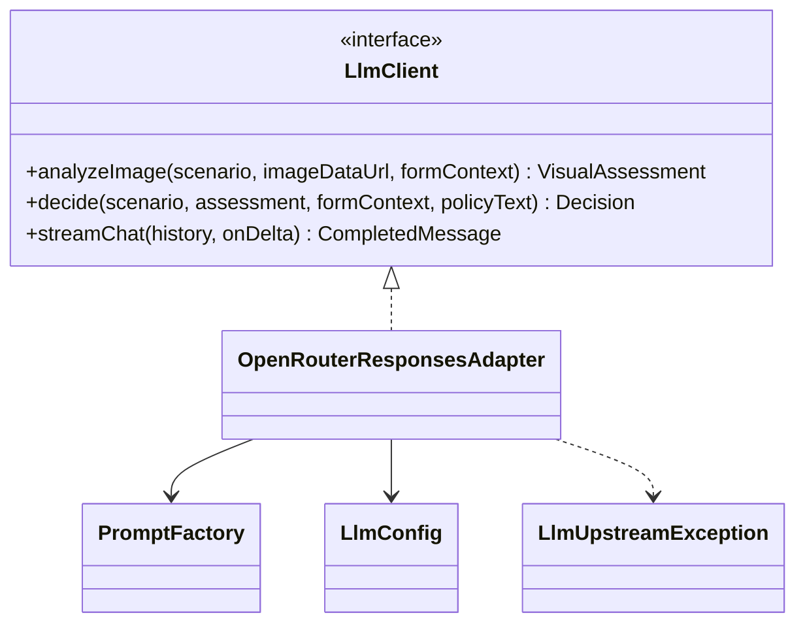
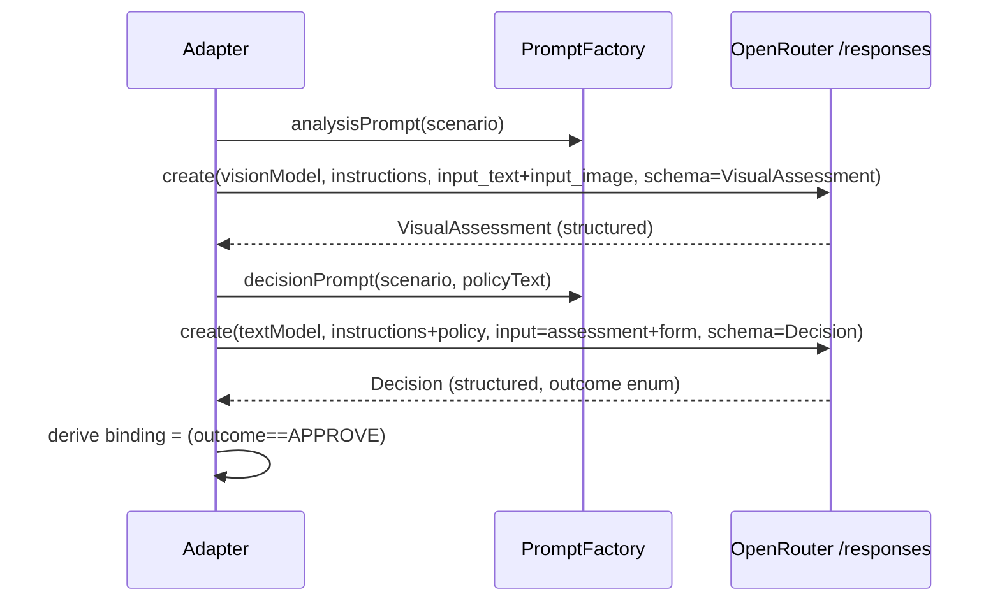
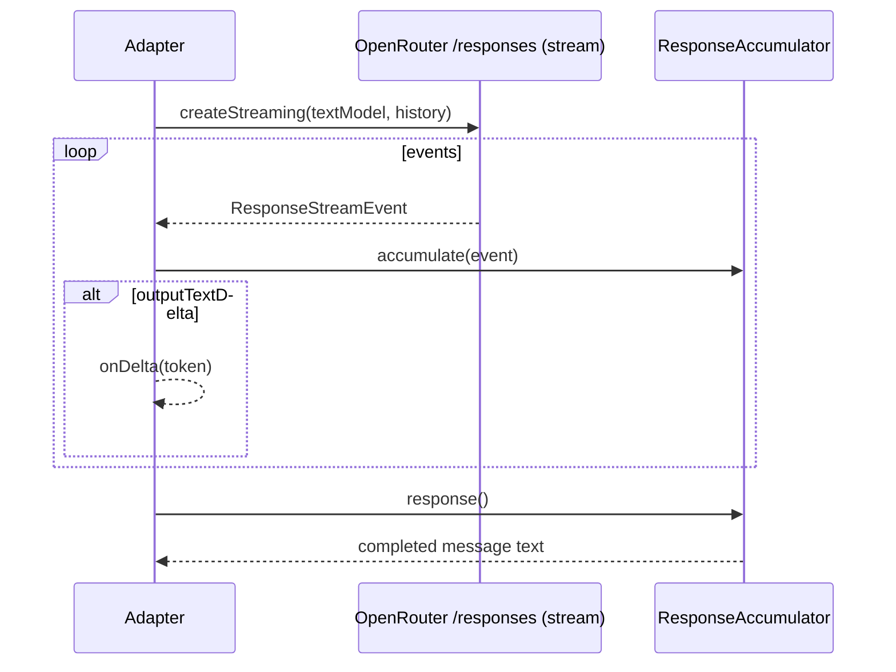
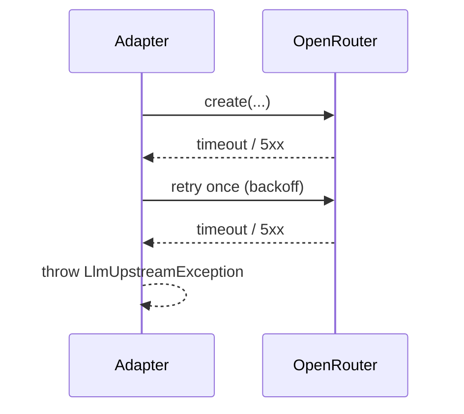

# ADR-002: LLM Integration (openai-java + OpenRouter Responses API)

**Date:** 2026-06-24
**Status:** Accepted
**Relates to:** [`000-main-architecture.md`](000-main-architecture.md)

---

## 1. Scope

Covers the `llm` module: the `LlmClient` port, the openai-java adapter targeting the OpenRouter
Responses API, the three LLM operations (image analysis, decision, streaming chat), prompt design
per scenario, structured output, model selection, and resilience (timeouts/retries). Does **not**
cover HTTP endpoints (see [`001`](001-backend-api.md)) or UI (see [`003`](003-frontend.md)).

---

## 2. Context7 References

| Library | Context7 Handle | Used for |
|---|---|---|
| OpenAI Java SDK | `/openai/openai-java` | `client.responses().create` / `createStreaming`, `ResponseInputImage`, `ResponseStreamEvent`, `ResponseAccumulator`, structured output, `baseUrl`/`apiKey`/additional headers |

External references:
- OpenRouter Responses overview — https://openrouter.ai/docs/api/reference/responses/overview
- OpenRouter "Create a response" — https://openrouter.ai/docs/api/api-reference/responses/create-responses

---

## 3. Component Design

### `LlmClient` port (interface)
Three operations, all provider-agnostic (no openai-java types in the signatures):
1. **analyzeImage(scenario, imageDataUrl, formContext) → VisualAssessment** — multimodal; returns a
   structured visual assessment.
2. **decide(scenario, assessment, formContext, policyText) → Decision** — reasoning step; returns the
   structured decision.
3. **streamChat(history, onDelta) → CompletedMessage** — streams assistant token deltas for follow-ups.

### `OpenRouterResponsesAdapter` (implementation)
- Builds one openai-java client configured with `baseUrl = OPENROUTER_BASE_URL`,
  `apiKey = OPENAI_API_KEY ?: OPENROUTER_API_KEY`, and optional OpenRouter ranking headers
  (`HTTP-Referer`, `X-Title`) via the SDK's additional-headers mechanism.
- **analyzeImage:** calls `client.responses().create` with the **vision model**
  (`OPENROUTER_VISION_MODEL`), `instructions` = scenario analysis system prompt, and `input`
  containing an `input_text` (the form context) plus an `input_image` (the base64 data URL, `detail`
  configurable). Requests **structured output** matching the `VisualAssessment` shape.
- **decide:** calls `client.responses().create` with the **text model** (`OPENROUTER_TEXT_MODEL`),
  `instructions` = scenario decision system prompt with the **policy document text injected**, and
  `input` = the visual assessment + form data. Requests **structured output** matching the `Decision`
  shape (outcome enum constrained to the three values).
- **streamChat:** calls `client.responses().createStreaming` with the text model and the full
  conversation history (system context + prior messages + new user message), forwarding
  `OutputTextDelta` events to the `onDelta` callback and accumulating the final text via
  `ResponseAccumulator`.

The adapter is the **only** code coupled to openai-java (Decision 8.2). It also normalizes upstream
failures into an `LlmUpstreamException` (timeout/5xx/parse error) for the `web` layer to map to
`502`/`503`.

### Scenario → prompt/policy/model routing

| `RequestType` | Analysis prompt | Decision prompt | Policy document | Models |
|---|---|---|---|---|
| `RETURN` | Judge whether the item shows signs of use/damage and whether it is resalable as new | Apply the return policy; decide Approve/Reject/Escalate | `docs/policies/return-policy.md` | vision + text |
| `COMPLAINT` | Judge whether/how the item is damaged and the most probable cause | Apply the complaint policy; weigh stated reason vs visual evidence | `docs/policies/complaint-policy.md` | vision + text |

---

## 4. Data Structures

- **Scenario** — derived from `RequestType` (`RETURN` | `COMPLAINT`); selects prompt, policy, schema.
- **VisualAssessment** (structured output) —
  - RETURN: `analyzable` (bool), `signsOfUse` (bool), `damageObserved` (bool), `resalableAsNew`
    (bool), `notes` (string), `confidence` (0–1).
  - COMPLAINT: `analyzable` (bool), `damaged` (bool), `damageType` (string), `damageLocation`
    (string), `probableCause` (string), `confidence` (0–1).
- **Decision** (structured output) — `outcome` (`APPROVE`|`REJECT`|`ESCALATE`), `justification`
  (markdown), `nextSteps` (string[]), `ruleReferences` (string[]). `binding` is derived in the
  backend (`true` iff `APPROVE`), not trusted from the model.
- **ChatTurn** — `role`, `content` (mapped to Responses API input items in the adapter).

> Prompt text itself is authored during implementation; this ADR fixes intent, inputs, outputs, and
> routing — not the wording.

---

## 5. Interface Contracts (port semantics)

- **analyzeImage** — Input: scenario, image data URL, compact form context. Output: `VisualAssessment`.
  Must set `analyzable=false` for blurry/wrong-item/inconclusive images (drives `ESCALATE`). Never
  invents a decision. Error: `LlmUpstreamException` on upstream failure/timeout; parse failure if the
  structured output is malformed after retry.
- **decide** — Input: scenario, assessment, form context, policy text. Output: `Decision` with
  `outcome` constrained to the three enum values; justification must cite a policy rule. Rules:
  Escalate when `analyzable=false`, when required input is missing, when stated reason contradicts the
  image (complaint), or when the date is missing/invalid; otherwise apply policy mapping.
- **streamChat** — Input: full history (includes the system context, the form data, the visual
  assessment, and the first decision message). Output: streamed deltas + the accumulated final
  message. The system prompt restricts answers to the customer's case and the complaint/return domain;
  off-topic requests get a brief redirect; the model must not contradict the original decision without
  a policy-grounded reason and must preserve the binding/preliminary framing.

---

## 6. Technical Decisions

### 6.1 Responses API via openai-java, OpenRouter-compatible client
**Status:** Accepted **Date:** 2026-06-24
**Context:** Implements Decision 8.1/8.2. openai-java supports the Responses API with vision input
and streaming and allows a custom `baseUrl`/`apiKey`, making it a drop-in for OpenRouter.
**Decision:** Use `client.responses().create` (analysis, decision) and `createStreaming` (chat) with
the OpenRouter base URL. Keep all SDK usage inside `OpenRouterResponsesAdapter`.
**Rejected alternatives:** Hand-rolled HTTP client — rejects type-safety/streaming helpers; Chat
Completions — not the chosen API (Decision 8.1).
**Consequences:** (+) Type-safe, streaming + structured-output helpers, isolated coupling. (−) Beta
API risk concentrated in one adapter.
**Review trigger:** Responses schema/beta changes; provider switch.

### 6.2 Structured outputs for assessment and decision
**Status:** Accepted **Date:** 2026-06-24
**Context:** AC-15 (exactly three outcomes) and deterministic first-message composition (Decision 8.5).
**Decision:** Request structured/JSON-schema output for `VisualAssessment` and `Decision`; constrain
`outcome` to the enum; derive `binding` server-side.
**Rejected alternatives:** Parse free text — brittle, risks invalid outcomes.
**Consequences:** (+) Deterministic, validated, testable. (−) Requires schema upkeep if fields change.
**Review trigger:** If a model/provider lacks structured-output support.

### 6.3 Two-step pipeline (analyze → decide) rather than one multimodal call
**Status:** Accepted **Date:** 2026-06-24
**Context:** PRD separates the visual assessment (multimodal model) from the policy decision
(reasoning model), and stores the assessment in the session for chat context.
**Decision:** Keep analysis and decision as two LLM calls with distinct models and prompts.
**Rejected alternatives:** Single combined call — couples vision and policy reasoning, harder to test,
loses a reusable assessment artifact.
**Consequences:** (+) Clear separation, reusable assessment, independent prompts/models. (−) Two
round-trips → higher latency/cost.
**Review trigger:** If latency/cost on the create-session path becomes unacceptable.

### 6.4 Resilience: timeouts, bounded retries, no fabricated decisions
**Status:** Accepted **Date:** 2026-06-24
**Context:** Beta upstream; PRD AC-26 forbids fabricated decisions on failure.
**Decision:** Per-call timeout; at most one retry on transient (timeout/5xx) errors with backoff;
on exhaustion raise `LlmUpstreamException` (→ `502`/`503`). Never synthesize an assessment/decision
on failure. Malformed structured output triggers a single re-ask, then failure.
**Rejected alternatives:** Unlimited retries — latency/cost; silent fallback decision — violates AC-26.
**Consequences:** (+) Predictable, honest failures. (−) Some user-visible retries.
**Review trigger:** Observed upstream error/latency profile in use.

---

## 7. Diagrams

### Component / Class Diagram

### Sequence — analyze then decide

### Sequence — streaming chat with accumulation

### Error path

---

## 8. Testing Strategy

### Test scenarios for this area

| Scenario | Type | Input | Expected output | Edge cases |
|---|---|---|---|---|
| Vision analysis (return) | Integration (MockWebServer) | Faked `/responses` returns return-assessment JSON | Mapped `VisualAssessment` with `resalableAsNew` | `analyzable=false` path |
| Vision analysis (complaint) | Integration | Faked complaint-assessment JSON | `VisualAssessment` with `probableCause` | Missing optional fields tolerated |
| Decision mapping (approve) | Integration | Faked decision JSON `outcome=APPROVE` | `Decision.binding=true` | Model returns invalid enum → re-ask then fail |
| Decision escalate on unclear | Unit/Integration | `assessment.analyzable=false` | `outcome=ESCALATE`, `binding=false` | Contradictory reason vs image (complaint) |
| Policy injection | Unit | Scenario=RETURN | Decision prompt includes return-policy text | Scenario=COMPLAINT uses complaint policy |
| Streaming chat | Integration | Faked SSE delta stream | `onDelta` called per token; accumulated final text | Empty stream; mid-stream error |
| Timeout/5xx | Integration | Faked 503 then 503 | One retry, then `LlmUpstreamException` | 503 then 200 → success |
| Header/baseUrl config | Unit | Env set | Client built with OpenRouter baseUrl + resolved key | `OPENAI_API_KEY` overrides `OPENROUTER_API_KEY` |

### Technical acceptance criteria
- **TAC-002-01:** No type from openai-java appears outside `OpenRouterResponsesAdapter` (and its config).
- **TAC-002-02:** Analysis and decision use structured output; `Decision.outcome` is always one of the three enum values; `binding` is derived server-side (`true` iff `APPROVE`).
- **TAC-002-03:** When `VisualAssessment.analyzable` is false, the decision is `ESCALATE`.
- **TAC-002-04:** The decision prompt for a scenario contains the corresponding policy document text.
- **TAC-002-05:** `streamChat` forwards ≥1 delta for a normal reply and returns the fully accumulated message.
- **TAC-002-06:** Transient upstream errors retry at most once, then raise `LlmUpstreamException`; no assessment/decision is fabricated on failure.
- **TAC-002-07:** The SDK client is configured from env with OpenRouter base URL and the documented key-resolution order.
