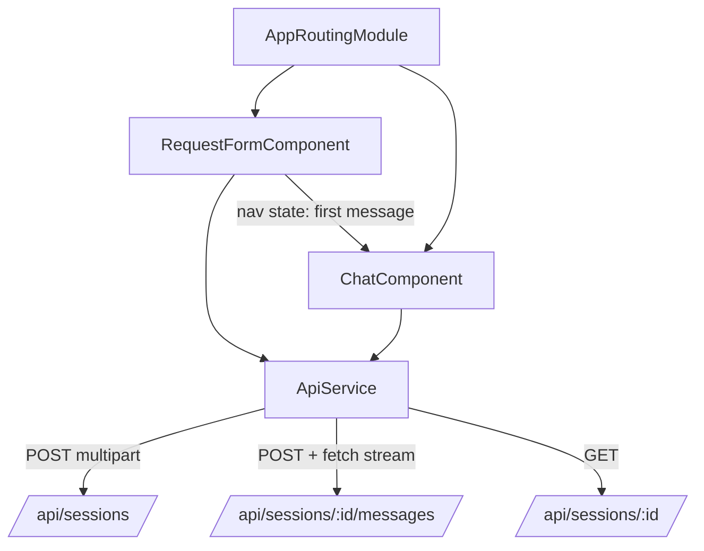
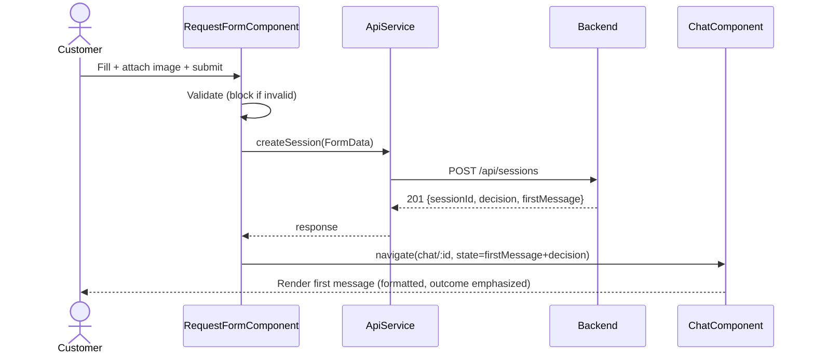
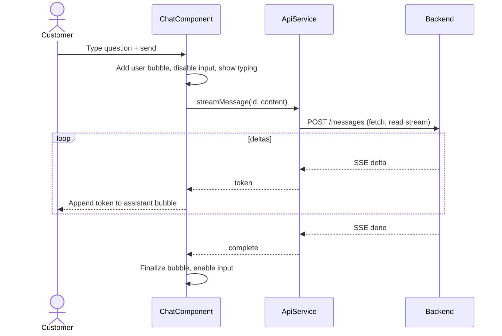

# ADR-003: Frontend (Angular + Angular Material)

**Date:** 2026-06-24
**Status:** Accepted
**Relates to:** [`000-main-architecture.md`](000-main-architecture.md)

---

## 1. Scope

Covers the Angular single-page application: the request-form screen, the decision+chat screen, the
API/SSE client, client-side validation, state, and routing. Does **not** cover backend endpoints
(see [`001`](001-backend-api.md)) or LLM behavior (see [`002`](002-llm-integration.md)).

---

## 2. Context7 References

| Library | Context7 Handle | Used for |
|---|---|---|
| Angular | `/angular/angular` | SPA framework, routing, reactive forms, services, HttpClient |
| Angular Material | `/websites/material_angular_dev` | Form fields, select, datepicker, buttons, cards, list, progress, snackbar |

---

## 3. Component Design

Two routed features plus shared services.

### Routes
- `''` → **RequestFormComponent** (the form).
- `'chat/:sessionId'` → **ChatComponent** (decision + conversation).
- `'**'` → redirect to the form.

### RequestFormComponent
- A reactive form with Angular Material controls:
  - `requestType` — `mat-select` (Complaint / Return).
  - `category` — `mat-select` (Smartphone, Laptop, Tablet, Headphones, Smartwatch, Other).
  - `modelName` — `matInput` text.
  - `purchaseDate` — `mat-datepicker`, max = today (future dates disabled).
  - `reason` — `matInput` textarea; `Validators.required` toggled on when `requestType=COMPLAINT`.
  - `image` — file input with a thumbnail preview and a remove/replace control.
- **Client-side validation (PRD AC-01..AC-09):** required fields; reason required only for complaints;
  image required; accept only `image/jpeg|png|webp`; reject > 10 MB with an inline message. The submit
  button is disabled until the form is valid.
- On submit: build `FormData`, call `ApiService.createSession`, show a loading state (disable form +
  `mat-progress-bar`/spinner), then navigate to `chat/:sessionId` passing the first message + decision.
- On error: map `400/413/415` to inline field/file errors; map `502/503` to a non-blocking
  `mat-snackbar` retry message while preserving entered values (no navigation, no decision shown).

### ChatComponent
- Renders a message list (`mat-list`/cards) of `ChatMessage`s; system/assistant bubbles distinct from
  user bubbles. The first message (greeting + decision + justification + status note + next steps) is
  shown formatted (markdown rendered to safe HTML), with the outcome visually emphasized (badge/heading).
- Message composer: `matInput` + send button; disabled while a reply streams; a typing indicator
  (`mat-progress`) shows during streaming.
- Sending a message calls `ApiService.streamMessage`, appending token deltas to the in-progress
  assistant bubble as they arrive; on `done`, finalizes the bubble. On stream `error`, shows an inline
  error with a retry affordance and keeps history intact.
- A "Start new request" action returns to the form with no carried-over data.

### Services
- **ApiService** —
  - `createSession(formData)` → `POST /api/sessions`, returns `CreateSessionResponse`.
  - `streamMessage(sessionId, content)` → `POST /api/sessions/{id}/messages` consumed as a **stream**
    via `fetch` + `ReadableStream` reader (the native `EventSource` is GET-only and cannot send a
    body), parsing `text/event-stream` frames into `delta`/`done`/`error` events exposed as an
    Observable/AsyncIterable.
  - `getSession(sessionId)` → `GET /api/sessions/{id}` (reload support).
- **Models** — TypeScript interfaces mirroring the backend DTOs (RequestType, EquipmentCategory,
  DecisionDto, CreateSessionResponse, ChatMessage, SSE event types).

State is component-local plus router navigation state for handing the first message from form to chat;
no global store is needed for the MVP. If a deep-link/reload to `chat/:sessionId` occurs without
navigation state, `ChatComponent` falls back to `getSession`.

---

## 4. Data Structures

- **RequestType**: `'COMPLAINT' | 'RETURN'`.
- **EquipmentCategory**: `'SMARTPHONE' | 'LAPTOP' | 'TABLET' | 'HEADPHONES' | 'SMARTWATCH' | 'OTHER'`.
- **DecisionDto**: `{ outcome: 'APPROVE'|'REJECT'|'ESCALATE'; binding: boolean; justification: string;
  nextSteps: string[]; ruleReferences: string[] }`.
- **CreateSessionResponse**: `{ sessionId: string; decision: DecisionDto; firstMessage: string;
  createdAt: string }`.
- **ChatMessage**: `{ role: 'SYSTEM'|'USER'|'ASSISTANT'; content: string; pending?: boolean }`.
- **SseEvent**: `{ type: 'delta'; token: string } | { type: 'done'; finishReason?: string } |
  { type: 'error'; code: string; message: string }`.
- **ApiError**: `{ code: string; message: string; fields?: Record<string,string> }`.

---

## 5. Interface Contracts (consumed)

| Call | Method/Path | Request | Response | Errors handled |
|---|---|---|---|---|
| Create session | `POST /api/sessions` | `multipart/form-data` (fields + image) | `201` `CreateSessionResponse` | `400`/`413`/`415` → inline; `502`/`503` → snackbar retry |
| Stream reply | `POST /api/sessions/{id}/messages` | JSON `{ content }` | `text/event-stream` | `404` → back to form; `400` → inline; mid-stream `error` → inline retry |
| Get session | `GET /api/sessions/{id}` | — | `200` snapshot | `404` → back to form |

All calls go to `/api/*` and are proxied to the backend in dev (`proxy.conf.json`), avoiding CORS.

---

## 6. Technical Decisions

### 6.1 Custom chat UI on Angular Material primitives
**Status:** Accepted **Date:** 2026-06-24
**Context:** Angular Material has no official chat component; ready-made chat SDKs are commercial and
assume their own backends.
**Decision:** Build a lightweight chat from Material primitives (cards/list, form field, progress,
snackbar). No third-party chat dependency.
**Rejected alternatives:** Stream Chat/Kendo/CometChat — licensing/cost and backend assumptions;
community Material chat module — less maintained, still needs SSE wiring.
**Consequences:** (+) No license cost, full control, clean SSE integration. (−) We build bubble/list
UI ourselves.
**Review trigger:** If rich chat features (reactions, attachments, threads) are required.

### 6.2 Consume SSE via `fetch` streaming, not `EventSource`
**Status:** Accepted **Date:** 2026-06-24
**Context:** The stream endpoint is a `POST` with a JSON body (Decision 6.1 in [`001`](001-backend-api.md));
`EventSource` only supports GET and cannot send a body.
**Decision:** Use `fetch` with a `ReadableStream` reader to parse `text/event-stream` frames into typed
events exposed to components.
**Rejected alternatives:** Switch endpoint to GET with query params — leaks content into URLs, length
limits; WebSocket — unnecessary.
**Consequences:** (+) Works with POST + body, typed events. (−) Manual SSE frame parsing.
**Review trigger:** If the backend moves to a GET-based stream.

### 6.3 Local component state + router state, no global store
**Status:** Accepted **Date:** 2026-06-24
**Context:** Single linear flow (form → chat); minimal shared state.
**Decision:** Pass the first message via router navigation state; keep chat history in the component;
fall back to `GET /api/sessions/{id}` on reload.
**Rejected alternatives:** NgRx/global store — over-engineering for the MVP.
**Consequences:** (+) Simpler. (−) Reload relies on the snapshot endpoint.
**Review trigger:** If multi-view shared state grows.

---

## 7. Diagrams

### Component Diagram

### Sequence — form to chat

### Sequence — streaming a reply

---

## 8. Testing Strategy

### Test scenarios for this area

| Scenario | Type | Input | Expected output | Edge cases |
|---|---|---|---|---|
| Reason required for complaint | Unit | Select Complaint, empty reason | Form invalid, submit disabled, inline error | Switching to Return clears the requirement |
| Image type/size validation | Unit | `.gif` file; 11 MB file | Inline error, submit disabled | Exactly 10 MB JPEG accepted |
| Future date blocked | Unit | Pick tomorrow | Datepicker max prevents/flags it | Today accepted |
| Successful submit → navigate | Unit | Valid form; ApiService mocked `201` | Navigates to `chat/:id` with first message | — |
| Submit error 413/415 | Unit | ApiService mocked error | Inline file error; values preserved; no nav | — |
| Submit error 503 | Unit | ApiService mocked `503` | Snackbar retry; values preserved; no decision shown | — |
| SSE parsing | Unit | Mocked stream of delta+done frames | Emits typed `delta` then `done` | Mid-stream `error` frame emits error event |
| Chat renders streamed reply | Unit | Mocked `streamMessage` deltas | Assistant bubble grows per token; input disabled then re-enabled | Stream error shows inline retry |
| Reload deep-link | Unit | Navigate to `chat/:id` w/o state | Calls `getSession`; renders snapshot | `404` → redirect to form |
| Full flow | E2E (Playwright) | Real stack | Form → decision → chat works end to end | Outcome emphasized; disclaimer visible for Reject/Escalate |

### Technical acceptance criteria
- **TAC-003-01:** Submit is disabled until all client-side validations pass; complaint requires a reason, return does not.
- **TAC-003-02:** Only `image/jpeg|png|webp` ≤ 10 MB are accepted client-side; violations show inline errors.
- **TAC-003-03:** The datepicker prevents selecting a future purchase date.
- **TAC-003-04:** On `201`, the app navigates to `chat/:sessionId` and renders the first message with the outcome visually emphasized and (for Reject/Escalate) the preliminary/human-review disclosure visible.
- **TAC-003-05:** On `502`/`503`, the app shows a retry message, preserves all entered values, and shows no decision.
- **TAC-003-06:** The chat consumes the SSE stream via `fetch`, renders deltas incrementally, disables input while streaming, and finalizes on `done`.
- **TAC-003-07:** A mid-stream `error` event surfaces an inline retry without losing prior history.
- **TAC-003-08:** All UI text is in Polish.
