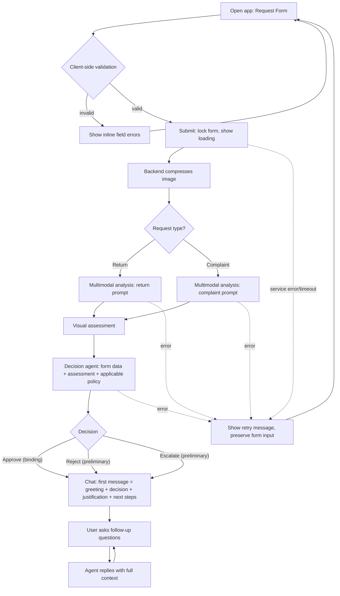

# PRD — Hardware Service Decision Copilot

> **Type:** MVP (Proof of Concept built live during the course).
> **Audience:** developer agents creating the ADR and implementing the app.
> This document defines functionality, system behavior, UX, and UI only.
> Technology, architecture, data schemas, prompt text, and testing strategy belong in the ADR.

---

## 1. Executive Summary

The Hardware Service Decision Copilot is a self-service web application that gives a customer an
immediate, evidence-based assessment of an electronics **complaint** (fault claim) or **return**
(no-fault refund) request. The customer completes a short form and uploads one photo of the item;
the system analyzes the photo with a multimodal model, applies the company complaint/return
policies, and returns a decision (**Approve / Reject / Escalate**) with a clear justification. The
assessment is then handed to a chat interface where the customer can ask follow-up questions. This
is an MVP that proves the form → analysis → decision → conversation flow end to end.

---

## 2. Problem Statement

When a customer wants to complain about a faulty device or return an unwanted one, they have no way
to know upfront whether their request is likely to be accepted. They submit a request blind, wait
for a human agent to review photos and policy, and only learn the outcome days later. This produces
avoidable back-and-forth, rejected requests that never met policy, and support queues filled with
cases that a clear rule check could have resolved instantly. There is no immediate, consistent,
policy-grounded first answer available to the customer at the moment of submission.

---

## 3. Users / Personas

### 3.1 Primary — Self-service customer (no fault claim)
A person who bought a device and changed their mind. They want to return it for a refund. They
expect a fast, plain-language answer on whether the item qualifies and what to do next.

### 3.2 Primary — Self-service customer (fault claim)
A person whose device is broken or defective. They want it repaired, replaced, or refunded. They
expect the system to look at their photo, understand the damage, and tell them whether it is covered
and why.

### 3.3 Secondary — Human service specialist (out of the normal loop)
A staff member who is **not** part of the live MVP flow but receives cases the system marks
**Escalate** or **Reject**. They are mentioned because every preliminary decision must be reviewable
by them. Their tooling is out of scope for this MVP.

> **Note:** The original brief framed this as an internal copilot for support staff. During PRD
> clarification the stakeholder chose **end-customer self-service** as the primary experience. Tone,
> disclaimers, and decision wording in this PRD follow that decision. See Section 12.

---

## 4. Main Flows

### 4.1 Happy path — Return, Approved
1. User opens the app and sees the request form.
2. User selects request type **Return**.
3. User selects equipment category, enters model name, picks purchase date.
4. User optionally enters a reason (not required for returns).
5. User uploads one photo of the item; client-side validation confirms format, size, and presence.
6. User submits. The form is locked and a loading state is shown.
7. Backend compresses the image and sends it with the **return** analysis prompt to the multimodal model.
8. The multimodal model returns a structured visual assessment (condition, signs of use, damage).
9. The decision agent combines the visual assessment, form data, and the **Return Policy** rules and produces a decision and justification.
10. The item is within the return window and shows no signs of use → decision = **Approve**.
11. The app transitions to the chat interface. The first system message greets the user, states the **Approve** decision, explains the reasoning, confirms it is binding, and lists next steps.
12. User may ask follow-up questions in chat; the agent answers using the full context.

### 4.2 Happy path — Complaint, Approved
1–6. As above, but request type is **Complaint**; the reason field is **mandatory**.
7. Backend compresses the image and sends it with the **complaint** analysis prompt to the multimodal model.
8. The multimodal model assesses whether the item is damaged, the damage type and location, and the most probable cause.
9. The decision agent combines the assessment, form data, stated reason, and the **Complaint Policy** rules.
10. Damage is consistent with a covered defect and within warranty → decision = **Approve**.
11–12. As 4.1 (chat interface, first message, follow-ups).

### 4.3 Alternative — Reject
- After analysis, the request fails policy (e.g., return shows signs of use, or complaint damage is clearly impact/liquid/misuse, or outside the eligibility window).
- Decision = **Reject**. The first chat message states the rejection, explains exactly which rule was not met, and discloses that this is a **preliminary** outcome reviewed by a human specialist before becoming final.

### 4.4 Alternative — Escalate
- The image is blurry, shows the wrong item, or is inconclusive; or the purchase date is missing/invalid; or the stated reason contradicts the image.
- Decision = **Escalate**. The first chat message explains that an automatic decision could not be made, states what is missing or unclear, and discloses that a human specialist will review the case.

### 4.5 Error path — Validation failure
- A required field is empty or invalid, or the image violates format/size rules.
- Submission is blocked. Inline field-level error messages are shown. No request is sent to the backend.

### 4.6 Error path — Analysis service failure
- The multimodal model or decision agent is unavailable, times out, or errors.
- The app shows a non-blocking error message inviting the user to retry. Form input is preserved. No decision is fabricated.

---

## 5. User Stories

1. **(Happy path — return)** As a customer who changed their mind, I want to submit my device details and a photo, so that I immediately learn whether my return qualifies for a refund.
2. **(Happy path — complaint)** As a customer with a broken device, I want the system to look at my photo and my description, so that I learn whether the fault is covered and why.
3. **(Decision clarity)** As a customer who received a decision, I want a plain-language justification tied to the actual policy rule, so that I understand the outcome and am not left guessing.
4. **(Follow-up conversation)** As a customer who has questions about my decision, I want to chat with the assistant which already knows my case, so that I do not have to re-enter my details.
5. **(Ambiguous evidence)** As a customer whose photo was unclear, I want the system to tell me it needs human review rather than guess, so that I am not given a wrong automated answer.
6. **(Invalid input)** As a customer who forgot a required field or uploaded a too-large file, I want immediate inline feedback, so that I can fix it before submitting.
7. **(Service down)** As a customer submitting during an outage, I want a clear retry message that keeps my entered data, so that I do not lose my work or receive a fake decision.

---

## 6. Acceptance Criteria

### Form
- **AC-01** The form provides a request-type selector with exactly two options: **Complaint** and **Return**.
- **AC-02** The form provides an equipment-category selector with exactly these options: Smartphone, Laptop, Tablet, Headphones, Smartwatch, Other.
- **AC-03** The form provides a free-text model/name input.
- **AC-04** The form provides a purchase-date picker that does not allow future dates.
- **AC-05** The reason field is **required** when request type is Complaint and **optional** when request type is Return.
- **AC-06** Exactly one image upload is **required**; the form cannot be submitted without it.
- **AC-07** The image upload accepts only JPEG, PNG, and WebP; any other type is rejected with an inline error.
- **AC-08** An image larger than 10 MB (pre-compression) is rejected with an inline error stating the limit.
- **AC-09** Submitting with any required field empty or invalid is blocked, with an inline error on each offending field, and no request is sent to the backend.

### Image Processing
- **AC-10** The backend compresses the uploaded image before sending it to the multimodal model.
- **AC-11** The original uploaded file is never sent to the multimodal model uncompressed when it exceeds the compression target.

### AI Decision
- **AC-12** The multimodal analysis uses a **return-specific** instruction set for Return requests and a **complaint-specific** instruction set for Complaint requests.
- **AC-13** For Return requests, the visual analysis reports whether the item shows signs of use or damage and whether it appears resalable as new.
- **AC-14** For Complaint requests, the visual analysis reports whether the item is damaged, the damage type/location, and the most probable cause.
- **AC-15** The decision agent returns exactly one of three outcomes: **Approve**, **Reject**, or **Escalate**.
- **AC-16** The decision agent's justification references the specific policy rule(s) that drove the outcome.
- **AC-17** The decision is produced from the visual assessment **plus** the form data **plus** the applicable policy document; missing any of these inputs results in **Escalate**, not a guess.
- **AC-18** When the image is blurry, depicts the wrong item, or is inconclusive, the outcome is **Escalate**.
- **AC-19** An **Approve** outcome is presented as a binding, actionable decision.
- **AC-20** A **Reject** or **Escalate** outcome is presented as **preliminary**, with an explicit statement that a human specialist reviews it before it becomes final.

### Chat
- **AC-21** After analysis, the app transitions from the form to a chat interface.
- **AC-22** The first chat message is system-authored and contains, in order: a greeting, the decision, the justification, the binding/preliminary status, and the next steps.
- **AC-23** The agent retains full context across the conversation: form data, the visual assessment, and the first decision message.
- **AC-24** The user can send follow-up messages and receives responses that are consistent with the original decision and context.
- **AC-25** The agent answers only within the scope of the customer's case and the complaint/return domain; off-topic requests are declined with a brief redirect.

### General / Error Handling
- **AC-26** On multimodal or agent failure (error or timeout), the app shows a retry message, preserves all form input, and does not display any decision.
- **AC-27** While analysis is in progress, the app shows a loading state and prevents duplicate submissions.
- **AC-28** All user-facing text is in English.

---

## 7. Out of Scope

- **Authentication / accounts** — no login, signup, or user identity in the MVP.
- **Customer & purchase-history lookup** — no retrieval of existing customer records (see Backlog).
- **Session & decision persistence** — sessions are not stored server-side in the MVP (see Backlog).
- **RAG knowledge base** — no vector knowledge base of specs/procedures beyond the two policy docs (see Backlog).
- **Specialist / admin UI** — no interface for human specialists to action escalated or rejected cases.
- **Multiple images / video** — exactly one image; no video, no multi-photo galleries.
- **Notifications** — no email, SMS, or push updates on case status.
- **Payments / refunds execution** — the system states a decision; it does not move money or create RMAs.
- **Multilingual support** — English only; no localization.
- **Mobile apps** — responsive web is acceptable; no native iOS/Android apps.
- **Editing a submitted request** — once submitted, the case is fixed for the session; the user starts over to change form data.

---

## 8. Constraints

### Business
- An **Approve** decision is binding and actionable; **Reject** and **Escalate** are preliminary and subject to human review. Wording must reflect this distinction.
- Every Reject and Escalate decision must carry the human-review disclosure.
- The agent must not provide legal advice; it applies company policy only.
- Decisions must be justified strictly against the provided policy documents — no invented rules.

### Functional
- Image: JPEG, PNG, or WebP; maximum 10 MB before compression; exactly one image, required.
- Equipment categories: Smartphone, Laptop, Tablet, Headphones, Smartwatch, Other.
- Purchase date cannot be in the future.
- Decision outcomes are limited to: Approve, Reject, Escalate.
- Language: English for all UI and policy documents.
- Target platform: modern desktop and mobile web browsers (responsive).

### External document / data references
| Document | Path | When it is used |
|---|---|---|
| Return Policy (example) | `docs/policies/return-policy.md` | Injected as the rule set for **Return** decisions. |
| Complaint Policy (example) | `docs/policies/complaint-policy.md` | Injected as the rule set for **Complaint** decisions. |

> The two policy documents are example seed content created for the MVP. The applicable document is
> selected by the request-type field and provided to the decision agent as the authoritative rules.

---

## 9. UI Description (wireframe level)

### 9.1 Request Form screen
- **Layout:** single-column form, top to bottom: request type, equipment category, model/name, purchase date, reason, image upload, submit button.
- **Request type:** selector with two choices (Complaint, Return). Selecting Complaint makes the reason field required; selecting Return makes it optional. The choice also determines which analysis and policy apply downstream.
- **Equipment category:** dropdown with the six fixed categories.
- **Model / name:** single-line text input.
- **Purchase date:** date picker; future dates disabled.
- **Reason:** multi-line textarea; shows a required indicator only when Complaint is selected.
- **Image upload:** single-file picker with a thumbnail preview after selection and a control to replace/remove the file. Shows accepted formats and the 10 MB limit as helper text.
- **Submit:** primary button; disabled until client-side validation passes.
- **Error states:** inline messages beneath each field for empty/invalid input, wrong file type, and oversized file.
- **Empty state:** the clean form on first load.
- **Loading state:** after submit, the form is disabled and a progress indicator communicates that the photo is being analyzed.

### 9.2 Decision + Chat screen
- **Layout:** conversational view. The first message is a system bubble; subsequent messages alternate between user and assistant. A message input with a send control sits at the bottom.
- **First system message (formatted):** greeting → decision (clearly labeled Approve / Reject / Escalate) → justification referencing the policy rule → binding-or-preliminary status note → next steps.
- **Decision emphasis:** the outcome is visually distinct from the explanatory text (e.g., a heading or badge), without prescribing colors here.
- **Input:** free-text message box; disabled while the assistant is responding.
- **Loading state:** a typing/thinking indicator while the assistant generates a reply.
- **Error state:** if a chat reply fails, an inline error with a retry affordance; the conversation history is preserved.
- **Navigation:** an option to start a new request returns the user to a fresh form (no data carried over).

### 9.3 Transitions
- Form → Chat occurs automatically once the decision is ready.
- On analysis failure, the user remains on the form with their data intact and a retry message.

---

## 10. User Flow Diagram

---

## 11. Agent / System Behavior Specification

### 11.1 Roles
- **Multimodal analyzer:** inspects the single uploaded image and produces a factual visual assessment. It does **not** decide the case. For Return it judges signs of use/damage and resalability; for Complaint it judges damage type, location, and probable cause.
- **Decision agent:** a reasoning agent that takes the visual assessment, the form data, and the applicable policy document, and produces the decision and justification. It also conducts the follow-up chat.

### 11.2 Allowed
- Apply the provided complaint/return policy rules to the case.
- Return exactly one outcome: Approve, Reject, or Escalate.
- Explain the outcome in plain language tied to specific policy rules.
- Answer follow-up questions about the customer's case and the complaint/return process.

### 11.3 Not allowed
- Inventing rules, eligibility windows, or exceptions not present in the policy document.
- Providing legal advice or interpreting statute.
- Producing a definitive Approve/Reject when key input is missing or the image is inconclusive — it must Escalate instead.
- Changing a stated decision arbitrarily during chat without a policy-grounded reason.
- Answering questions unrelated to the case or the complaint/return domain.

### 11.4 Decision categories and communication
- **Approve** — request meets policy. Communicated as a **binding, actionable** decision with next steps.
- **Reject** — request fails a specific policy rule. Communicated with the exact failing rule and the **preliminary / human-review** disclosure.
- **Escalate** — evidence is missing, contradictory, or inconclusive. Communicated with what is unclear/missing and the **human-review** disclosure.

### 11.5 Mandatory disclosures
- Reject and Escalate messages must state that the outcome is preliminary and reviewed by a human specialist before becoming final.
- The agent must not present itself as giving legally binding consumer-rights determinations beyond company policy.

### 11.6 Off-topic and out-of-scope handling
- If the user asks something unrelated to their case or the complaint/return domain, the agent briefly declines and redirects to the case at hand.

### 11.7 Language and tone
- English only. Tone is clear, respectful, and customer-facing: concise, non-technical, and empathetic for Reject/Escalate outcomes.

---

## 12. Further Notes

### Assumptions
- The persona was changed from internal-staff copilot (original brief) to **end-customer self-service** per stakeholder decision during clarification. The product name is retained.
- The two policy documents in `docs/policies/` are example starters and are expected to be replaced with real company policy.
- The graceful analysis-failure behavior (AC-26) was specified as a baseline robustness requirement even though only client-side validation was explicitly prioritized; confirm during ADR if a stricter or simpler behavior is preferred.

### Deferred to ADR / implementation
- Concrete prompt text for the multimodal analyzer and decision agent (return vs complaint variants).
- Image compression parameters (target size/format/dimensions).
- Model selection, hosting, and API choices.
- Data schema and storage decisions for the Backlog items below.

### Backlog (planned future features — architect with these in mind)
- **Session & decision persistence:** store every session, decision, and action taken for audit and history.
- **Customer & purchase-history lookup:** retrieve existing customer data and purchase history and inject it into the agent context.
- **RAG knowledge base:** an internal retrieval knowledge base covering electronics specifications and complaint/return procedures, beyond the two policy documents.

> The architecture should be designed so these three features can be added without reworking the
> core form → analysis → decision → chat flow.
